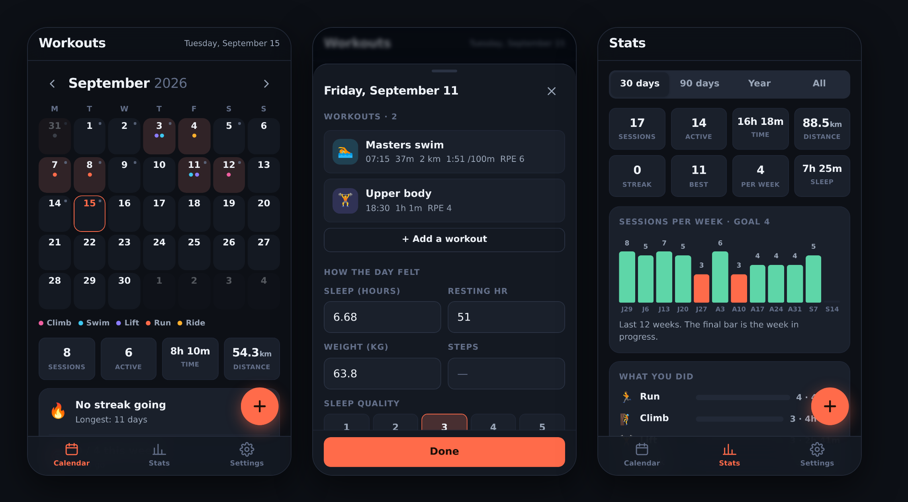

# Workouts

A personal workout calendar that runs in the browser. Open it on your phone,
tap a day, log what you did. Nothing to install, no account, no server — your
data lives on your device.



## What it does

**Calendar** — a month grid where every day you trained is tinted and dotted
with the colour of the activity. Swipe left and right between months. A small
grey square in a day's corner means you also logged sleep, weight or a note.

**Logging** — tap a day (or the `+` button) and record type, title, duration,
distance, elevation, average HR, calories and effort (RPE 1–10), plus free
notes. Distance and elevation only appear for activities where they make
sense, and pace is shown the way each sport reads it: `/km` for runs, `km/h`
for rides, `/100m` for swims.

**How the day felt** — per-day sleep hours and quality, resting HR, weight,
steps, energy, soreness and notes. These are what turn "did I train?" into
"why did that week feel awful?".

**Stats** — sessions, active days, total time and distance over 30/90/365 days
or all time; current and longest streak; sessions per week against a goal you
set; a breakdown by activity; a consistency grid; and sleep/resting-HR/weight
averages.

## Get it on your phone

1. **Settings → Pages** in this repo → Source: **GitHub Actions**.
2. Push to the default branch (or run *Deploy to GitHub Pages* manually from the
   **Actions** tab). The workflow deploys whichever branch is the repo default,
   so it keeps working if you later rename it to `main`.
3. Open `https://annika-thomas.github.io/workouts/`.
4. On iPhone: Share → **Add to Home Screen**. On Android: menu → **Install app**.

*Source: Deploy from a branch* works too — there's no build step, the repo root
is the site.

It then opens full-screen with its own icon, works offline, and keeps its data
between launches.

### Running it locally

No build, no dependencies — but it does need to be *served*, not opened as a
`file://` URL, because it uses ES modules:

```sh
python3 -m http.server 8000
# then open http://localhost:8000
```

## Where your data lives

Everything is in `localStorage` under a single key, on the device you used.
That means it is private by default and works offline — and also that clearing
your browser data deletes it. So:

- **Settings → Your data → Backup JSON** downloads the whole database.
  Worth doing now and then.
- **Restore** merges a backup back in. Conflicts resolve by "last edited
  wins", so restoring an older file never overwrites newer entries.
- **Workouts CSV / Days CSV** export flat tables for a spreadsheet.

Tokens and secrets are stripped out of every export, so a backup file is safe
to email yourself.

### Syncing phone and laptop

Optional, in **Settings → Sync across devices**. It keeps a copy of the
database in a *secret* GitHub gist:

1. Create a token at [github.com/settings/tokens](https://github.com/settings/tokens)
   with only the **gist** scope.
2. Paste it in, leave Gist ID blank, tap **Back up now** — it creates the gist
   and fills in the ID.
3. On your other device, paste the same token *and* gist ID, then
   **Restore from gist**.

It is manual on purpose: you press back up, you press restore. Nothing syncs
behind your back.

## Connecting Strava

**Settings → Strava → Set up Strava.** One-time setup:

1. Go to [strava.com/settings/api](https://www.strava.com/settings/api) and
   create an application (any name will do).
2. Set **Authorization Callback Domain** to your Pages host exactly —
   `yourusername.github.io`, no `https://`, no path.
3. Copy the **Client ID** and **Client Secret** into the app and tap
   *Save & authorise*.

After that, **Sync now** pulls in new activities: type, name, time, distance,
elevation, moving time and average HR. Activities are matched on their Strava
ID, so re-syncing updates rather than duplicates, and any notes or RPE you
added here are kept.

A caveat worth knowing: Strava has no browser-only auth flow, so the client
secret is stored in this browser's localStorage and the token exchange happens
from the page. For a personal tracker on your own phone that is a reasonable
trade; it is why you should not host this page somewhere other people sign in.
If your browser or network blocks the exchange, the app says so and the import
route below works just as well.

## Importing from anything else

**Settings → Your data → Choose CSV.** The importer reads the file, guesses
which column is which, and shows you the mapping to correct before anything is
saved. Then it previews what it will add — including how many rows it will skip
as duplicates — and only writes when you confirm.

It handles dates in ISO, `D/M/YYYY` and `Sep 12, 2026, 7:04:12` forms;
durations as minutes, seconds, `1:23:45` or `1h 23m`; and distance in km,
miles or metres (you pick). So it works with:

- **Strava** — request your archive at *Settings → My Account → Download or
  Delete Your Account → Request your archive*, then import `activities.csv`.
- **Smart scales (Renpho and similar)** — export from the app, import the
  weight and body-fat columns into your daily metrics.
- **Sleep and recovery trackers** (Oura, Whoop, AutoSleep, Garmin) — map the
  sleep-duration and resting-HR columns.
- Anything else with a date column, including your own spreadsheet.

Workout rows and daily-metric rows can come from the same file; each column is
mapped independently.

## Layout

```
index.html              markup shell — loads one ES module
manifest.webmanifest    PWA manifest (home-screen name, icons, colours)
sw.js                   service worker: offline cache of the app shell
css/app.css             all styling; design tokens at the top
js/
  main.js               boot, tab routing, the floating add button
  store.js              the data model, persistence, and derived stats
  types.js              activity taxonomy (colours, icons, Strava mapping)
  theme.js              dark/light/auto
  util/date.js          local-day keys, month grids, loose date parsing
  util/units.js         metric/imperial display, pace, speed, durations
  util/dom.js           element helper, toasts, dialogs, file pick/download
  ui/calendar.js        month grid, streaks, recent list
  ui/day.js             day sheet: workouts + how the day felt
  ui/editor.js          add/edit one workout
  ui/stats.js           ranges, weekly chart, breakdowns, consistency grid
  ui/settings.js        preferences, Strava, import/export, sync
  ui/importSheet.js     CSV column mapping and preview
  ui/sheet.js           bottom-sheet component
  ui/icons.js           inline SVG icons
  integrations/
    csv.js              CSV parse/serialise
    importer.js         column guessing, unit handling, record building
    strava.js           OAuth, token refresh, activity sync
    gist.js             backup/restore through a secret gist
```

### Making changes

Two things to remember:

- Add an activity type in `js/types.js`. The `key` is what gets stored, so
  renaming an existing one needs a migration in `store.js`.
- After editing any file, bump `CACHE` in `sw.js`. Otherwise a phone that has
  already installed the app keeps serving the old version.
